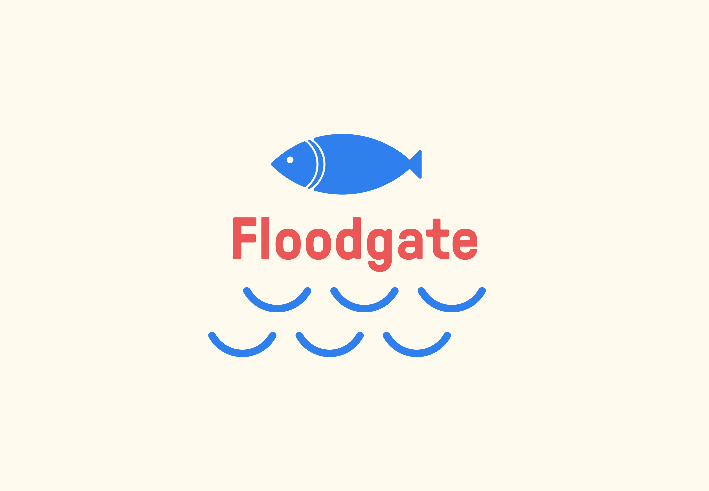
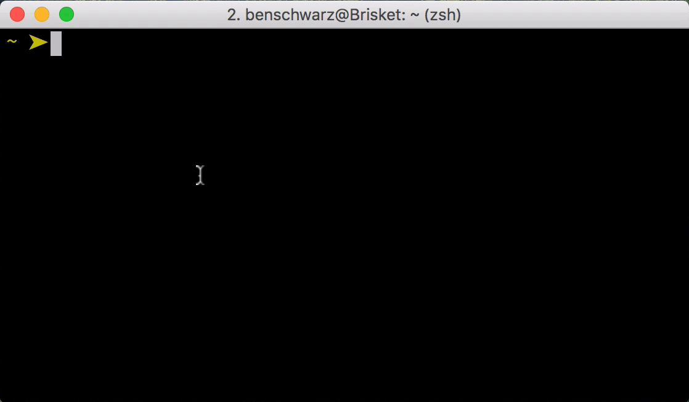

<p align="center">
  
</p>

<p align="center">
  Cross-platform, configurable, and reliable bandwidth limiting.
</p>

---

# Features

* **Cross-platform and self-contained.** Floodgate is a single statically compiled binary with no external dependencies, and
is released for macOS, Linux and Windows. Don't want to install Node, Python or anything else? Unzip and start using right away!
* **Real-world connection profiles.** Floodgate ships with pre-defined connection profiles that [Calibre](https://calibreapp.com) uses as part of [Test Profiles](https://calibreapp.com/docs/site/test-profiles).

## 🍃 Install

Floodgate is packaged as pre-compiled binaries that work on all major operating systems. There are no dependencies to install, it just works. Everywhere.

| Operating system | download |
|------------------|----------|
| Mac OS           | [Download](https://cdn.lstoll.net/artifacts/floodgate/floodgate_darwin_amd64.tgz) |
| Linux            | [Download](https://cdn.lstoll.net/artifacts/floodgate/floodgate_linux_amd64.tgz) |
| Windows          | [Download](https://cdn.lstoll.net/artifacts/floodgate/floodgate_windows_386.tgz) |

Unzip, copy the binary, and run!

<p align="center">
  
</p>


## 🖥 Usage

```
Usage of floodgate:
  -latency string
    	Latency to add to operations, in ms (required)
  -listen string
    	address to listen on, e.g 127.0.0.1:8000 (required)
  -rate string
    	rate to limit to, in kpbs (required)
```

## Using floodgate with Google Chrome

If you wish to reliably limit the bandwidth available to Chrome or Chromium, you can do so by starting Chrome with the `--proxy-server` flag.

1. Start floodgate `./floodgate`
2. Start Chrome:

```
google-chrome-canary --proxy-server="socks://localhost:8000" https://calibreapp.com
```

3. The browser is now using a bandwidth limited connection.


## 🤔 FAQs

* Why not use the network limiting feature in Google Chrome? 

Because Chrome has many connection types (h2, h2 with server push, http, longpoll, SSE, etc) and it attempts to limit the connection on a per-tab basis, it is really difficult to reliably limit the connection speed for your site. Floodgate circumvents that by providing a proxy server that limits all traffic that it processes.

* Can I use this with browsers that aren't Chrome?

Yes! Start floodgate and then configure your browser of choice to use a SOCKS5 proxy.


## 💃 Want to contribute? 

Great! Please submit an issue (but preferably, a pull request) with your ideas or fixes. We'll do our best to review and discuss. 
